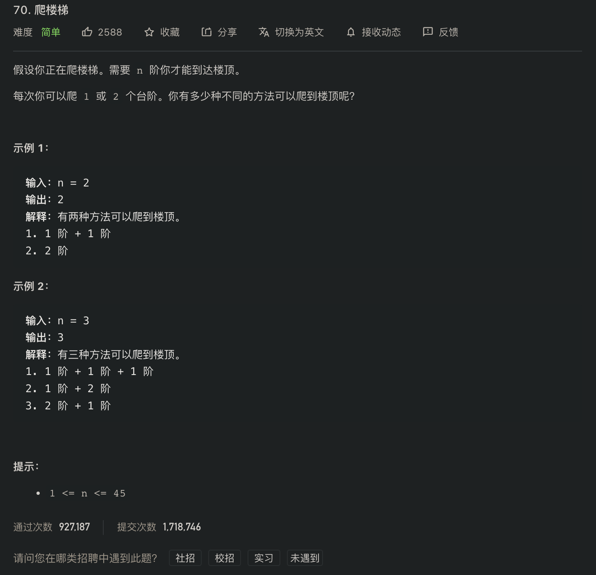
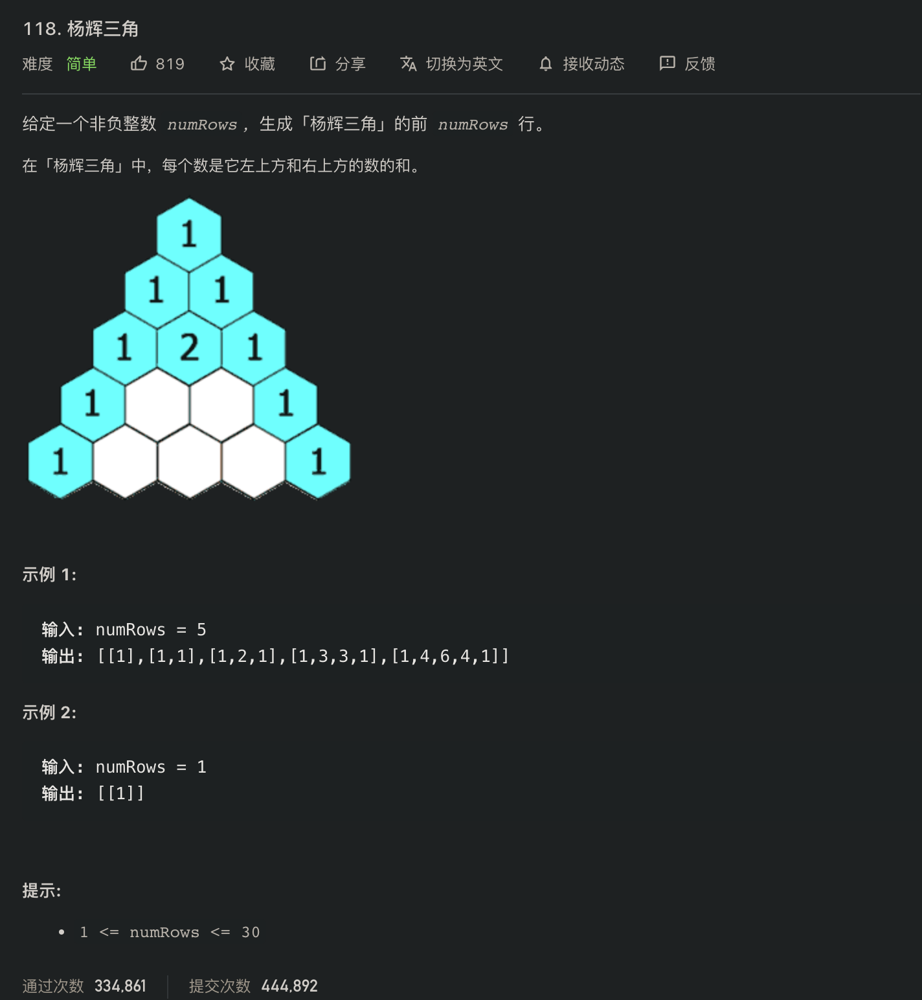
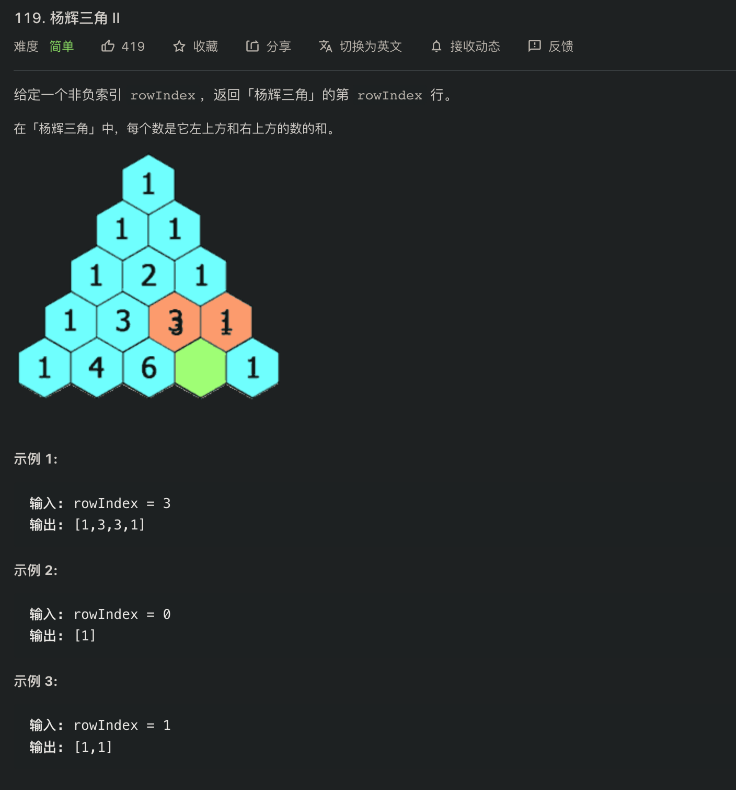
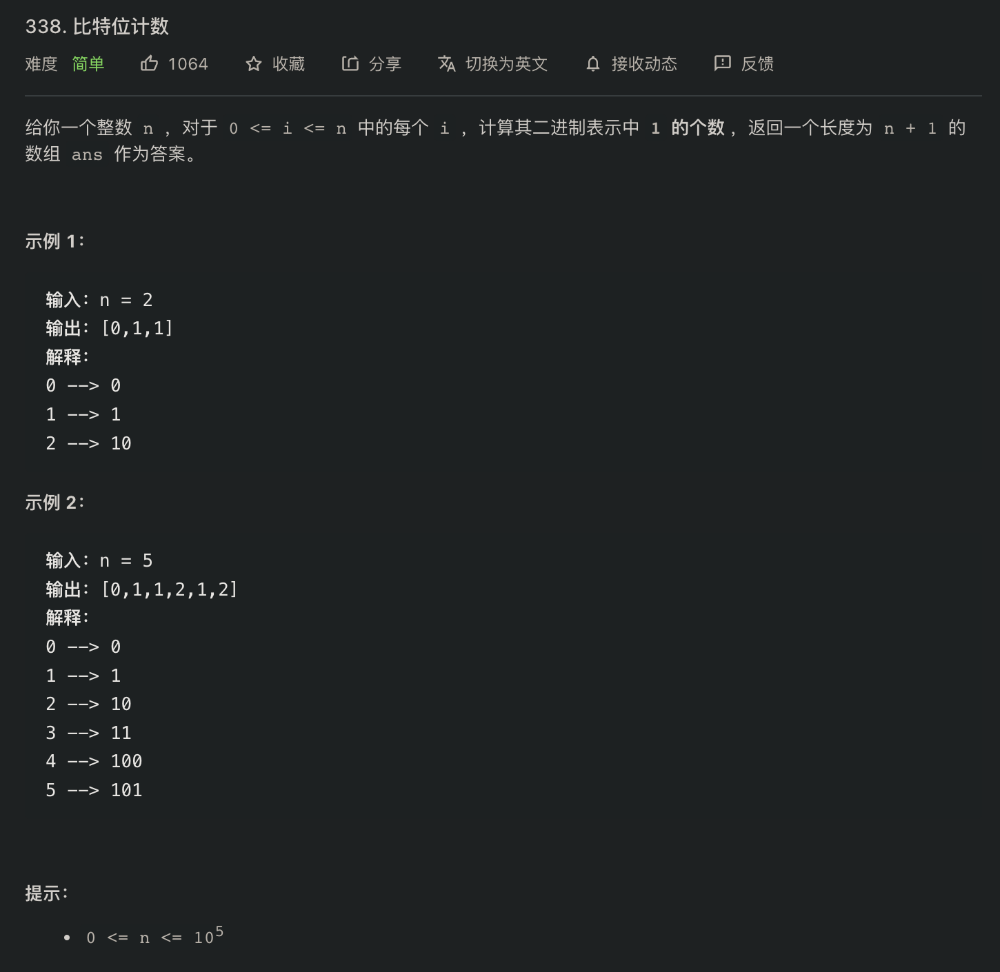

# Leetcode

## Dynamic Programming

### [70. 爬楼梯](DynamicProgramming/70.go)

### [118. 杨辉三角](DynamicProgramming/118.go)

### [119. 杨辉三角2](DynamicProgramming/119.go)

### [338 比特位计数](DynamicProgramming/338.go)
